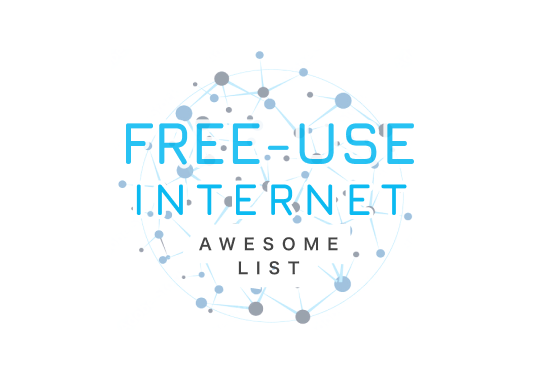

<!-- title -->
# Awesome Free

<!-- subtitle -->

A list of available tools and sources for free internet access!

<!-- image -->

<!-- description -->

A list of available tools and sources for free internet access! This tool create for make easier 

to access Iranian to free internet.

<!-- TOC -->

## Contents

- [Featured (new releases)](#featured-new-releases)
- [Section 1](#section-1)
- [Follow](#follow)

<!-- CONTENT -->

## Featured (new releases)

- [Apple](https://apple.com) - Apple as a placeholder.

## Section 1

- [Microsoft](https://www.microsoft.com/) - Microsoft as an example.

<!-- END CONTENT -->

## Follow

<!-- list people worth following on social sites (Twitter, LinkedIn, GitHub, YouTube etc.) -->

Who else should we be following!?

## Contributing

[Contributions of any kind welcome, just follow the guidelines](contributing.md)!

### Contributors

[Thanks goes to these contributors](https://github.com/YOUR_GITHUB_USER/YOUR_REPO/graphs/contributors)!
